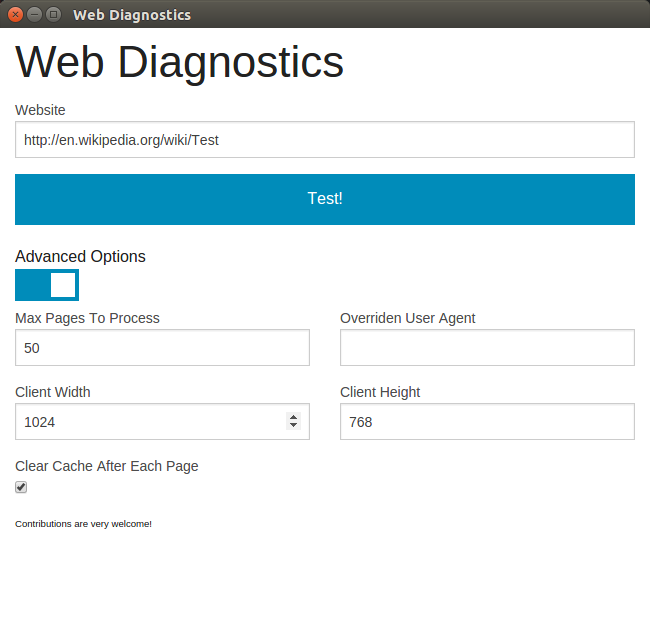

# Web Diagnostics
This is a Chrome App for measuring testing web pages on the client. It can currently report JavaScript warnings and errors, page load times and asset load times. Because it runs on the client, it can be extended to do any number of things. For example, it could be extended to test that a disclaimer correctly appears on every page of your site.

The app uses a [webview](https://developer.chrome.com/apps/tags/webview) to make requests. This is like a powerful iframe. It runs in its own process and chrome provides a nice methods and events for interacting with it.

It is experimental, not tested and not in the chrome app store.

## Contributing

If this project serves as a good starting point for you, please modify it to your heart's content. You can build it by installing node, gulp and bower and running the `npm install` and `gulp` commands. This will output the chrome app to the 'dist' folder. Chrome will let you run it straight from this directory.

The code has a plugin based architecture. There are currently only two plugins: one measures page load times and the other records JavaScript warnings and errors. Adding a new plugin is relatively straight forward:

1. Add a new entry into app/scripts/model/plugins.js. This is where you hook into events to collect data.
2. Create a view to display your results in app/views/plugins.

### Stack

Fairly standard:

* Chrome App
* Angular
* Foundation
* Sass
* Gulp

## TODO

* There is no error handling
* Things can also go awry if a url returns a redirect
* More plugins to make it useful
* Better data visualisation
